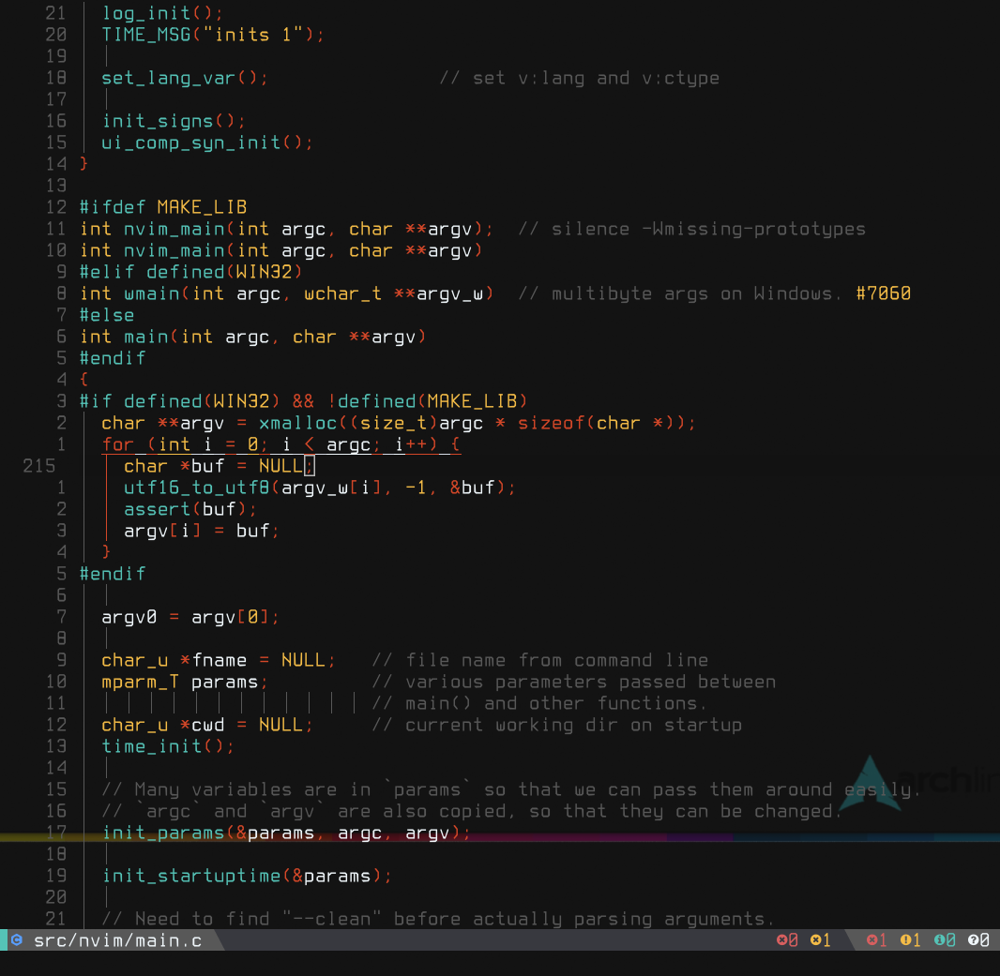

# Metropolis

High contrast, minimalist neovim colorscheme inspired by
[GMK Metropolis Keycaps](https://duckduckgo.com/?t=ffab&q=gmk+metropolis&iax=images&ia=images)




### Features

 - High constrast
 - Non distracting (only 4 colors)
 - Meant to be used with [Treesitter](https://github.com/nvim-treesitter/nvim-treesitter)
 - Language specific configuration

### Install

```vim
" Install using your plugin manager, in this case junegunn/vim-plug
Plug 'nvim-treesitter/nvim-treesitter', {'do': ':TSUpdate'}
Plug 'eruizc-dev/metropolis-vim'

" Use this colorscheme
colorscheme metropolis
```
